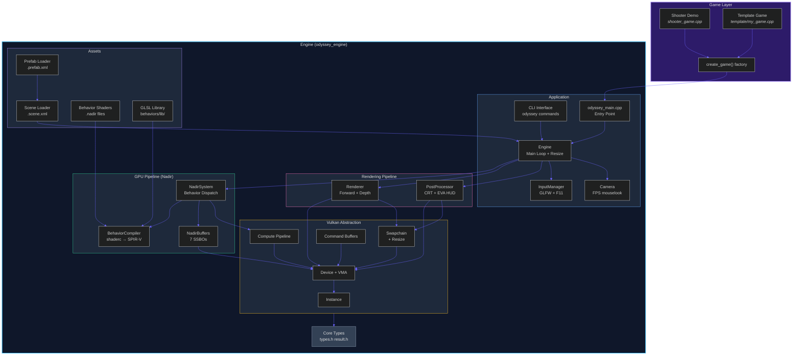
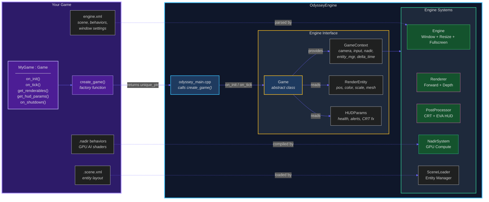
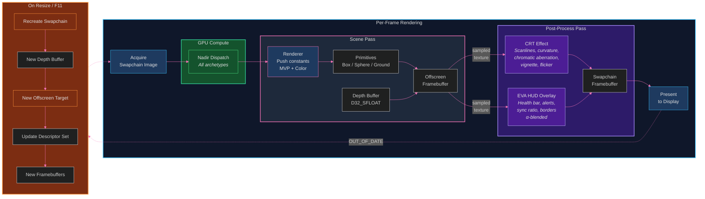
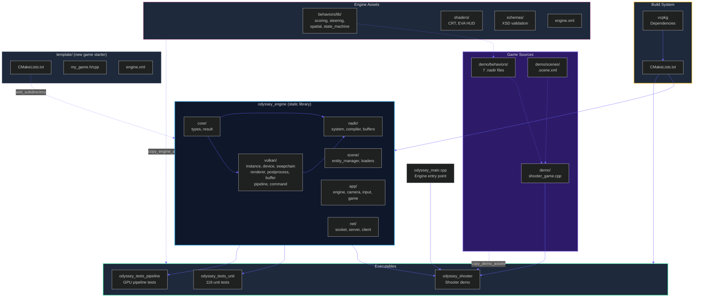

# OdysseyEngine Architecture Diagrams

## System Architecture

```mermaid
%%{init: {'theme': 'dark', 'themeVariables': {'primaryColor': '#1a1a2e', 'primaryTextColor': '#e0e0e0', 'primaryBorderColor': '#6c63ff', 'lineColor': '#6c63ff', 'secondaryColor': '#16213e', 'tertiaryColor': '#0f3460'}}}%%
graph TB
    subgraph GAME["Game Layer"]
        direction LR
        SHOOTER["Shooter Demo<br/><i>shooter_game.cpp</i>"]
        TEMPLATE["Template Game<br/><i>template/my_game.cpp</i>"]
        FACTORY["create_game() factory"]
    end

    subgraph ENGINE["Engine (odyssey_engine)"]
        subgraph APP["Application"]
            direction LR
            CLI["CLI Interface<br/>odyssey commands"]
            ENG["Engine<br/>Main Loop + Resize"]
            MAIN["odyssey_main.cpp<br/>Entry Point"]
            INPUT["InputManager<br/>GLFW + F11"]
            CAM["Camera<br/>FPS mouselook"]
        end

        subgraph RENDER["Rendering Pipeline"]
            direction LR
            REND["Renderer<br/>Forward + Depth"]
            POST["PostProcessor<br/>CRT + EVA HUD"]
        end

        subgraph GPU["GPU Pipeline (Nadir)"]
            direction LR
            NADIR["NadirSystem<br/>Behavior Dispatch"]
            COMPILER["BehaviorCompiler<br/>shaderc → SPIR-V"]
            BUFFERS["NadirBuffers<br/>7 SSBOs"]
        end

        subgraph VK["Vulkan Abstraction"]
            direction LR
            INST["Instance"]
            DEV["Device + VMA"]
            SWAP["Swapchain<br/>+ Resize"]
            PIPE["Compute Pipeline"]
            CMD["Command Buffers"]
        end

        subgraph ASSETS["Assets"]
            direction LR
            SCENES["Scene Loader<br/>.scene.xml"]
            PREFABS["Prefab Loader<br/>.prefab.xml"]
            SHADERS["Behavior Shaders<br/>.nadir files"]
            GLSLLIB["GLSL Library<br/>behaviors/lib/"]
        end

        CORE["Core Types<br/>types.h  result.h"]
    end

    SHOOTER --> FACTORY
    TEMPLATE --> FACTORY
    FACTORY --> MAIN
    MAIN --> ENG
    CLI --> ENG

    ENG --> NADIR
    ENG --> REND
    ENG --> POST
    ENG --> INPUT
    ENG --> CAM

    NADIR --> COMPILER
    NADIR --> BUFFERS
    NADIR --> PIPE

    REND --> DEV
    POST --> DEV
    REND --> SWAP
    POST --> SWAP

    BUFFERS --> DEV
    PIPE --> DEV
    CMD --> DEV
    SWAP --> DEV
    DEV --> INST

    SCENES --> ENG
    PREFABS --> SCENES
    SHADERS --> COMPILER
    GLSLLIB --> COMPILER

    VK --> CORE

    style GAME fill:#2d1b69,stroke:#a78bfa,stroke-width:2px,color:#e0e0e0
    style ENGINE fill:#0f172a,stroke:#38bdf8,stroke-width:2px,color:#e0e0e0
    style APP fill:#1e293b,stroke:#60a5fa,stroke-width:1px,color:#e0e0e0
    style RENDER fill:#1e293b,stroke:#f472b6,stroke-width:1px,color:#e0e0e0
    style GPU fill:#1e293b,stroke:#34d399,stroke-width:1px,color:#e0e0e0
    style VK fill:#1e293b,stroke:#fbbf24,stroke-width:1px,color:#e0e0e0
    style ASSETS fill:#1e293b,stroke:#a78bfa,stroke-width:1px,color:#e0e0e0
    style CORE fill:#334155,stroke:#94a3b8,stroke-width:1px,color:#e0e0e0
```

## Engine/Game Separation

```mermaid
%%{init: {'theme': 'dark', 'themeVariables': {'primaryColor': '#1e293b', 'primaryTextColor': '#e0e0e0', 'lineColor': '#6c63ff'}}}%%
graph LR
    subgraph GAMEDEV["Your Game"]
        direction TB
        GAME_IMPL["MyGame : Game<br/>─────────────<br/>on_init()<br/>on_tick()<br/>get_renderables()<br/>get_hud_params()<br/>on_shutdown()"]
        FACTORY["create_game()<br/><i>factory function</i>"]
        GAME_CFG["engine.xml<br/><i>scene, behaviors,<br/>window settings</i>"]
        NADIR_FILES[".nadir behaviors<br/><i>GPU AI shaders</i>"]
        SCENE_FILES[".scene.xml<br/><i>entity layout</i>"]

        GAME_IMPL --> FACTORY
    end

    subgraph ENGINE["OdysseyEngine"]
        direction TB
        ENTRY["odyssey_main.cpp<br/><i>calls create_game()</i>"]

        subgraph IFACE["Engine Interface"]
            GAME_ABC["Game<br/><i>abstract class</i>"]
            CONTEXT["GameContext<br/><i>camera, input, nadir,<br/>entity_mgr, delta_time</i>"]
            RENT["RenderEntity<br/><i>pos, color, scale, mesh</i>"]
            HUD["HUDParams<br/><i>health, alerts, CRT fx</i>"]
        end

        subgraph SYSTEMS["Engine Systems"]
            ENG_CORE["Engine<br/>Window + Resize + Fullscreen"]
            RENDERER["Renderer<br/>Forward + Depth"]
            POSTPROC["PostProcessor<br/>CRT + EVA HUD"]
            NADIR_SYS["NadirSystem<br/>GPU Compute"]
            SCENE_SYS["SceneLoader<br/>Entity Manager"]
        end
    end

    FACTORY -->|"returns unique_ptr"| ENTRY
    ENTRY -->|"on_init / on_tick"| GAME_ABC
    GAME_ABC -->|"provides"| CONTEXT
    GAME_ABC -->|"reads"| RENT
    GAME_ABC -->|"reads"| HUD
    GAME_CFG -.->|"parsed by"| ENG_CORE
    NADIR_FILES -.->|"compiled by"| NADIR_SYS
    SCENE_FILES -.->|"loaded by"| SCENE_SYS
    CONTEXT --> SYSTEMS

    style GAMEDEV fill:#2d1b69,stroke:#a78bfa,stroke-width:3px,color:#e0e0e0
    style ENGINE fill:#0f172a,stroke:#38bdf8,stroke-width:3px,color:#e0e0e0
    style IFACE fill:#1e293b,stroke:#fbbf24,stroke-width:2px,color:#e0e0e0
    style SYSTEMS fill:#1e293b,stroke:#34d399,stroke-width:2px,color:#e0e0e0
    style GAME_IMPL fill:#4c1d95,stroke:#c4b5fd,stroke-width:2px,color:#e0e0e0
    style FACTORY fill:#4c1d95,stroke:#c4b5fd,stroke-width:1px,color:#e0e0e0
    style GAME_ABC fill:#1e3a5f,stroke:#fbbf24,stroke-width:2px,color:#e0e0e0
    style ENTRY fill:#1e3a5f,stroke:#38bdf8,stroke-width:2px,color:#e0e0e0
    style ENG_CORE fill:#14532d,stroke:#4ade80,stroke-width:1px,color:#e0e0e0
    style RENDERER fill:#14532d,stroke:#f472b6,stroke-width:1px,color:#e0e0e0
    style POSTPROC fill:#14532d,stroke:#f472b6,stroke-width:1px,color:#e0e0e0
    style NADIR_SYS fill:#14532d,stroke:#34d399,stroke-width:1px,color:#e0e0e0
```

## Resize / Fullscreen Flow

```mermaid
%%{init: {'theme': 'dark', 'themeVariables': {'primaryColor': '#1e293b', 'primaryTextColor': '#e0e0e0', 'primaryBorderColor': '#6c63ff', 'lineColor': '#60a5fa'}}}%%
flowchart TD
    START(["process_frame()"])
    START --> INPUT["Poll Input + F11 Check"]

    INPUT --> F11{F11 pressed?}
    F11 -->|Yes| TOGGLE["toggle_fullscreen()<br/>glfwSetWindowMonitor()<br/>Set framebuffer_resized_ = true"]
    F11 -->|No| FENCE
    TOGGLE --> FENCE

    FENCE["vkWaitForFences(in_flight)"]
    FENCE --> GAMETICK["Game::on_tick()<br/>Readback + Logic"]

    GAMETICK --> ACQUIRE["vkAcquireNextImageKHR()"]
    ACQUIRE --> ACQ_CHECK{Result?}

    ACQ_CHECK -->|"OUT_OF_DATE"| RECREATE
    ACQ_CHECK -->|"SUCCESS / SUBOPTIMAL"| RESET_FENCE

    RESET_FENCE["vkResetFences(in_flight)<br/><i>Only after successful acquire</i>"]
    RESET_FENCE --> RECORD["Record Command Buffer<br/>Nadir Dispatch + Scene Render<br/>+ CRT/EVA Post-Process"]

    RECORD --> SUBMIT["vkQueueSubmit(fence)"]
    SUBMIT --> PRESENT["vkQueuePresentKHR()"]

    PRESENT --> PRES_CHECK{"Result?<br/>OR framebuffer_resized_?"}
    PRES_CHECK -->|"OUT_OF_DATE /<br/>SUBOPTIMAL / resized"| RECREATE
    PRES_CHECK -->|OK| DONE(["Next Frame"])

    subgraph RECREATE["recreate_swapchain()"]
        direction TB
        R1["Handle minimization<br/>(wait if 0×0)"]
        R1 --> R2["vkDeviceWaitIdle()"]
        R2 --> R3["Destroy old image views"]
        R3 --> R4["create_swapchain()<br/>(pass old handle)"]
        R4 --> R5["Destroy retired swapchain"]
        R5 --> R6["Renderer::recreate_for_resize()<br/>New depth buffer + framebuffers"]
        R6 --> R7["PostProcessor::recreate_for_resize()<br/>New offscreen target + descriptor<br/>+ scene/post framebuffers"]
        R7 --> R8["framebuffer_resized_ = false"]
    end

    RECREATE --> DONE

    style START fill:#334155,stroke:#94a3b8,stroke-width:2px,color:#e0e0e0
    style DONE fill:#334155,stroke:#94a3b8,stroke-width:2px,color:#e0e0e0
    style RECREATE fill:#1e1b4b,stroke:#a78bfa,stroke-width:2px,color:#e0e0e0
    style TOGGLE fill:#4c1d95,stroke:#c4b5fd,stroke-width:1px,color:#e0e0e0
    style ACQ_CHECK fill:#7c2d12,stroke:#fb923c,stroke-width:2px,color:#e0e0e0
    style PRES_CHECK fill:#7c2d12,stroke:#fb923c,stroke-width:2px,color:#e0e0e0
    style F11 fill:#1e3a5f,stroke:#60a5fa,stroke-width:1px,color:#e0e0e0
    style RESET_FENCE fill:#14532d,stroke:#4ade80,stroke-width:1px,color:#e0e0e0
    style R4 fill:#1e3a5f,stroke:#38bdf8,stroke-width:1px,color:#e0e0e0
    style R6 fill:#1e3a5f,stroke:#f472b6,stroke-width:1px,color:#e0e0e0
    style R7 fill:#1e3a5f,stroke:#f472b6,stroke-width:1px,color:#e0e0e0
```

## Rendering Pipeline

```mermaid
%%{init: {'theme': 'dark', 'themeVariables': {'primaryColor': '#1e293b', 'primaryTextColor': '#e0e0e0', 'lineColor': '#f472b6'}}}%%
flowchart LR
    subgraph FRAME["Per-Frame Rendering"]
        direction LR

        ACQ["Acquire<br/>Swapchain Image"]

        subgraph COMPUTE["GPU Compute"]
            NADIR["Nadir Dispatch<br/><i>All archetypes</i>"]
        end

        subgraph SCENE["Scene Pass"]
            direction TB
            OFS_FB["Offscreen<br/>Framebuffer"]
            DEPTH["Depth Buffer<br/>D32_SFLOAT"]
            REND["Renderer<br/>Push constants<br/>MVP + Color"]
            MESHES["Primitives<br/>Box / Sphere / Ground"]

            REND --> MESHES
            MESHES --> OFS_FB
            DEPTH --> OFS_FB
        end

        subgraph POST["Post-Process Pass"]
            direction TB
            CRT["CRT Effect<br/><i>Scanlines, curvature,<br/>chromatic aberration,<br/>vignette, flicker</i>"]
            EVA["EVA HUD Overlay<br/><i>Health bar, alerts,<br/>sync ratio, borders</i><br/><i>α-blended</i>"]
            SWAP_FB["Swapchain<br/>Framebuffer"]

            CRT --> SWAP_FB
            EVA --> SWAP_FB
        end

        PRESENT["Present<br/>to Display"]
    end

    ACQ --> NADIR
    NADIR --> REND
    OFS_FB -->|"sampled<br/>texture"| CRT
    OFS_FB -->|"sampled<br/>texture"| EVA
    SWAP_FB --> PRESENT

    subgraph RESIZE["On Resize / F11"]
        direction TB
        RE_SC["Recreate Swapchain"]
        RE_DEPTH["New Depth Buffer"]
        RE_OFS["New Offscreen Target"]
        RE_DESC["Update Descriptor Set"]
        RE_FB["New Framebuffers"]

        RE_SC --> RE_DEPTH --> RE_OFS --> RE_DESC --> RE_FB
    end

    PRESENT -.->|"OUT_OF_DATE"| RESIZE
    RESIZE -.-> ACQ

    style FRAME fill:#0f172a,stroke:#38bdf8,stroke-width:2px,color:#e0e0e0
    style COMPUTE fill:#14532d,stroke:#34d399,stroke-width:2px,color:#e0e0e0
    style SCENE fill:#1e293b,stroke:#f472b6,stroke-width:2px,color:#e0e0e0
    style POST fill:#2d1b69,stroke:#a78bfa,stroke-width:2px,color:#e0e0e0
    style RESIZE fill:#7c2d12,stroke:#fb923c,stroke-width:2px,color:#e0e0e0
    style CRT fill:#4c1d95,stroke:#c4b5fd,stroke-width:1px,color:#e0e0e0
    style EVA fill:#4c1d95,stroke:#c4b5fd,stroke-width:1px,color:#e0e0e0
    style NADIR fill:#14532d,stroke:#4ade80,stroke-width:1px,color:#e0e0e0
    style REND fill:#1e3a5f,stroke:#f472b6,stroke-width:1px,color:#e0e0e0
    style ACQ fill:#1e3a5f,stroke:#38bdf8,stroke-width:1px,color:#e0e0e0
    style PRESENT fill:#1e3a5f,stroke:#38bdf8,stroke-width:1px,color:#e0e0e0
    style RE_SC fill:#7c2d12,stroke:#fb923c,stroke-width:1px,color:#e0e0e0
    style RE_OFS fill:#7c2d12,stroke:#fb923c,stroke-width:1px,color:#e0e0e0
```

## Build System

```mermaid
%%{init: {'theme': 'dark', 'themeVariables': {'primaryColor': '#1a1a2e', 'primaryTextColor': '#e0e0e0', 'lineColor': '#6c63ff'}}}%%
graph TB
    subgraph BUILD["Build System"]
        CMAKE["CMakeLists.txt"]
        VCPKG["vcpkg<br/>Dependencies"]
    end

    subgraph LIB["odyssey_engine (static library)"]
        direction LR
        CORE["core/<br/>types, result"]
        VULKAN_LIB["vulkan/<br/>instance, device, swapchain<br/>renderer, postprocess, buffer<br/>pipeline, command"]
        NADIR_LIB["nadir/<br/>system, compiler, buffers"]
        SCENE_LIB["scene/<br/>entity_manager, loaders"]
        APP_LIB["app/<br/>engine, camera, input, game"]
        NET_LIB["net/<br/>socket, server, client"]
    end

    subgraph EXEC["Executables"]
        SHOOTER["odyssey_shooter<br/>Shooter demo"]
        TESTS_U["odyssey_tests_unit<br/>118 unit tests"]
        TESTS_P["odyssey_tests_pipeline<br/>GPU pipeline tests"]
    end

    subgraph GAME_SRC["Game Sources"]
        DEMO["demo/<br/>shooter_game.cpp"]
        DEMO_B["demo/behaviors/<br/>7 .nadir files"]
        DEMO_S["demo/scenes/<br/>.scene.xml"]
    end

    subgraph ENGINE_ASSETS["Engine Assets"]
        GLSL_LIB["behaviors/lib/<br/>scoring, steering,<br/>spatial, state_machine"]
        SHADERS["shaders/<br/>CRT, EVA HUD"]
        SCHEMAS["schemas/<br/>XSD validation"]
        CONFIG["engine.xml"]
    end

    subgraph TMPL["template/ (new game starter)"]
        TMPL_CMAKE["CMakeLists.txt"]
        TMPL_GAME["my_game.h/cpp"]
        TMPL_CFG["engine.xml"]
    end

    MAIN_CPP["odyssey_main.cpp<br/>Engine entry point"]

    VCPKG --> CMAKE
    CMAKE --> LIB
    CMAKE --> EXEC

    CORE --> VULKAN_LIB
    CORE --> NADIR_LIB
    VULKAN_LIB --> NADIR_LIB

    LIB --> SHOOTER
    LIB --> TESTS_U
    LIB --> TESTS_P

    MAIN_CPP --> SHOOTER
    DEMO --> SHOOTER
    DEMO_B -.-> DEMO
    DEMO_S -.-> DEMO

    GLSL_LIB -.-> DEMO_B

    ENGINE_ASSETS -.->|copy_engine_assets| EXEC
    GAME_SRC -.->|copy_demo_assets| SHOOTER

    TMPL_CMAKE -.->|add_subdirectory| LIB

    style BUILD fill:#1e293b,stroke:#fbbf24,stroke-width:2px,color:#e0e0e0
    style LIB fill:#0f172a,stroke:#38bdf8,stroke-width:2px,color:#e0e0e0
    style EXEC fill:#1e293b,stroke:#34d399,stroke-width:2px,color:#e0e0e0
    style GAME_SRC fill:#2d1b69,stroke:#a78bfa,stroke-width:2px,color:#e0e0e0
    style ENGINE_ASSETS fill:#1e293b,stroke:#f472b6,stroke-width:1px,color:#e0e0e0
    style TMPL fill:#1e293b,stroke:#94a3b8,stroke-width:1px,color:#e0e0e0
```
